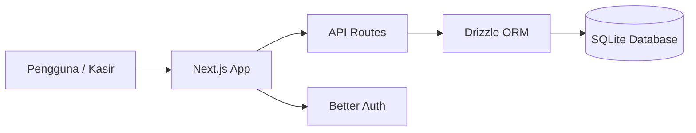

# PRD — Project Requirements Document

## 1. Overview

Distributor FMCG (Fast-Moving Consumer Goods) sering menghadapi masalah dalam mengelola operasional harian karena pencatatan masih tersebar di banyak tempat: catatan pesanan di kertas, stok di buku, pembelian dari supplier di catatan terpisah, dan riwayat pelanggan tidak terdokumentasi. Akibatnya, sulit melacak riwayat belanja pelanggan, stok sering tidak sesuai, dan rekap penjualan memakan waktu.

Aplikasi ini menyatukan semua kebutuhan inti distributor FMCG dalam satu platform yang sederhana (Lean POS), yaitu:
- POS / kasir untuk mencatat pesanan pelanggan secara tunai/lunas.
- Manajemen stok barang dengan satu satuan standar.
- Pencatatan pembelian dari supplier untuk menambah stok.
- Profil pelanggan beserta riwayat dan total belanjanya.
- Rekap penjualan sederhana untuk memantau pendapatan dan produk terlaris.

Tujuan utamanya adalah mempermudah distributor dalam mencatat transaksi yang langsung lunas, memantau stok, dan melacak riwayat pelanggan tanpa kerumitan fitur akuntansi yang kompleks. Aplikasi juga disiapkan untuk production deployment menggunakan Docker.

## 2. Requirements

- **Pencatatan Pesanan**: Aplikasi harus bisa mencatat pesanan pelanggan dengan cepat, menghitung total, mencatat pembayaran lunas, dan menyimpan transaksi.
- **Riwayat Pelanggan**: Setiap pesanan yang tersimpan otomatis tercatat sebagai riwayat belanja pelanggan untuk memantau loyalitas.
- **Manajemen Stok**: Aplikasi menampilkan jumlah stok terkini per produk, mencatat barang masuk, dan memberi peringatan saat stok menipis.
- **Pencatatan Pembelian**: Aplikasi mencatat pembelian barang dari supplier untuk menambah inventaris secara resmi.
- **Rekap Penjualan**: Menyediakan total pendapatan harian, volume transaksi, dan daftar produk terlaris tanpa perhitungan laba/rugi.
- **Satu Platform**: Semua data tersimpan dalam satu database SQLite terpusat.
- **Production Deployment**: Aplikasi bisa dijalankan di server menggunakan Dockerfile.
- **Keamanan dan Antarmuka**: Menggunakan autentikasi RBAC (Admin, Kasir, Gudang) dengan tampilan yang bersih dan mudah dioperasikan.

## 3. Core Features

### Fase 1 — Kasir
- **Buat Pesanan** — Mulai pesanan baru untuk transaksi langsung lunas.
- **Cari Produk** — Temukan produk berdasarkan nama atau SKU.
- **Hitung & Bayar** — Total belanja otomatis dan pencatatan pembayaran tunai/transfer (transaksi langsung selesai).
- **Simpan Pesanan** — Validasi stok secara atomik sebelum menyimpan untuk mencegah stok minus.
- **Cetak Struk** — Cetak struk belanja format thermal atau PDF segera setelah transaksi atau dari riwayat.
- **Pembatalan Pesanan** — Membatalkan transaksi salah; status menjadi **Batal**, stok otomatis dikembalikan (restock) ke inventaris.

### Fase 2 — Inventaris & Pelanggan
- **Data Pelanggan** — Daftar pelanggan, kontak, dan riwayat total belanja kumulatif.
- **Stok Barang** — Tampilan stok produk (satu satuan, misal: "Pcs" atau "Dus").
- **Penyesuaian Stok** — Fitur khusus untuk *stock opname* atau koreksi selisih fisik secara manual.
- **Peringatan Stok** — Notifikasi visual saat stok di bawah angka minimum.
- **Log Audit Pergerakan** — Riwayat lengkap perubahan stok per produk (siapa, kapan, dan kenapa).

### Fase 3 — Pembelian & Supplier
- **Manajemen Supplier** — Daftar data kontak penyuplai barang.
- **Buat Pembelian** — Mencatat transaksi belanja stok ke supplier.
- **Terima Barang** — Fitur utama untuk menambah jumlah stok barang secara otomatis melalui dokumen pembelian.
- **Riwayat Pembelian** — Rekam jejak seluruh barang masuk dari supplier.

### Fase 4 — Rekap Penjualan
- **Dashboard Ringkas** — Total pendapatan dan jumlah transaksi harian.
- **Filter Periode** — Lihat performa penjualan dalam rentang tanggal tertentu.
- **Produk Terlaris** — Daftar produk yang paling banyak terjual.
- **Ekspor Data CSV** — Fitur untuk mengunduh riwayat belanja, laporan stok, laporan pembelian, dan laporan penjualan yang digabungkan ke dalam satu file format CSV (multi-section CSV) dengan opsi rentang waktu atau semua data.

## 4. User Flow

### Alur Kasir Mencatat Pesanan (Lunas)
1. Kasir login ke aplikasi.
2. Membuka menu **Kasir** dan mencari produk.
3. Aplikasi memvalidasi stok di keranjang.
4. Kasir memilih pelanggan dan memasukkan jumlah bayar.
5. Kasir menekan **Simpan Pesanan**.
6. Aplikasi melakukan validasi stok ulang secara atomik.
7. Pesanan tersimpan sebagai **Selesai**, stok berkurang, dan audit log tercatat.
8. Kasir mencetak struk untuk pelanggan.

### Alur Pembatalan Pesanan
1. Pengguna (Admin/Kasir) mencari pesanan di **Riwayat Pesanan**.
2. Memilih opsi **Batalkan**.
3. Aplikasi mengubah status menjadi **Batal**, mengembalikan stok ke tabel produk, dan mencatat pergerakan stok masuk kembali.

### Alur Penyesuaian Stok (Stock Opname)
1. Petugas Gudang masuk ke menu **Stok**.
2. Memilih produk dan menu **Penyesuaian**.
3. Menginput angka stok fisik terbaru.
4. Sistem menghitung selisih dan mencatatnya sebagai tipe `adjustment`.

### Alur Penerimaan Barang Supplier
1. Pengguna membuat dokumen **Pembelian**.
2. Memilih supplier dan daftar barang yang dibeli.
3. Setelah barang sampai, menekan **Terima Barang**.
4. Stok produk otomatis bertambah sesuai jumlah di dokumen pembelian.

## 5. Architecture

Aplikasi ini menggunakan arsitektur monolitik modern untuk kemudahan deployment.

- **Frontend & Backend**: Next.js (Full-stack).
- **Autentikasi**: Better Auth dengan **RBAC**:
    - **Admin**: Akses penuh.
    - **Kasir**: Menu Kasir, Pelanggan, dan Cetak Struk.
    - **Gudang**: Menu Stok, Supplier, dan Pembelian.
- **Database**: SQLite untuk penyimpanan data dalam satu file.
- **Deployment**: Dockerized untuk lingkungan produksi.

## 6. Database Schema

### Tabel `users`
| Field | Tipe | Kegunaan |
|---|---|---|
| id | uuid | Identitas unik |
| name | text | Nama user |
| email | text | Email login |
| password | text | Hash password |
| role | text | Admin, Kasir, atau Gudang |

### Tabel `customers`
| Field | Tipe | Kegunaan |
|---|---|---|
| id | uuid | Identitas unik |
| name | text | Nama pelanggan |
| phone | text | Kontak |
| address | text | Alamat |

### Tabel `products`
| Field | Tipe | Kegunaan |
|---|---|---|
| id | uuid | Identitas unik |
| sku | text | Kode barang |
| name | text | Nama produk |
| unit | text | Satuan (misal: Pcs, Dus) |
| price | number | Harga jual |
| stock_qty | number | Stok saat ini |
| min_stock | number | Batas minimum |

### Tabel `orders`
| Field | Tipe | Kegunaan |
|---|---|---|
| id | uuid | ID Transaksi |
| customer_id | uuid | Relasi pelanggan |
| user_id | uuid | Kasir yang melayani |
| order_date | timestamp | Waktu transaksi |
| total | number | Total nilai pesanan |
| status | text | Selesai atau Batal |
| payment_method | text | Tunai/Transfer |

### Tabel `order_items`
| Field | Tipe | Kegunaan |
|---|---|---|
| id | uuid | ID Baris |
| order_id | uuid | Relasi pesanan |
| product_id | uuid | Relasi produk |
| quantity | number | Jumlah beli |
| price | number | Harga saat kejadian |
| subtotal | number | Qty x Price |

### Tabel `suppliers`
| Field | Tipe | Kegunaan |
|---|---|---|
| id | uuid | ID Supplier |
| name | text | Nama supplier |
| phone | text | Kontak |

### Tabel `purchases`
| Field | Tipe | Kegunaan |
|---|---|---|
| id | uuid | ID Pembelian |
| supplier_id | uuid | Relasi supplier |
| user_id | uuid | Petugas gudang |
| purchase_date | timestamp | Waktu beli |
| total | number | Total belanja |
| status | text | Diterima / Menunggu |

### Tabel `purchase_items`
| Field | Tipe | Kegunaan |
|---|---|---|
| id | uuid | ID Baris |
| purchase_id | uuid | Relasi pembelian |
| product_id | uuid | Relasi produk |
| quantity | number | Jumlah beli |
| cost | number | Harga beli unit |

### Tabel `stock_movements`
| Field | Tipe | Kegunaan |
|---|---|---|
| id | uuid | ID Audit |
| product_id | uuid | Relasi produk |
| user_id | uuid | Pelaksana |
| type | text | Penjualan, Pembelian, Penyesuaian |
| quantity | number | Perubahan (+/-) |
| reference_type | text | 'order', 'purchase', atau 'adjustment' |
| reference_id | uuid | ID terkait referensi |
| created_at | timestamp | Waktu kejadian |

## 7. Tech Stack

| Bagian | Teknologi |
|---|---|
| Frontend & Backend | Next.js |
| Styling | Tailwind CSS & shadcn/ui |
| Database | SQLite |
| ORM | Drizzle ORM |
| Autentikasi | Better Auth |
| Deployment | Docker |